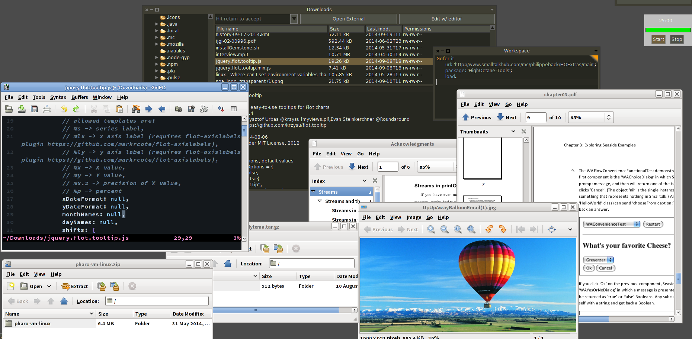

External Tools
==============

I had enough to switch between windows to work on external files.

So, here is *ExternalTools*.

It adds some commands to the ``File Browser``, allowing one to edit in the `$EDITOR` (for me this is `gvim`) and another thing for opening the file externally through `xdg-open` (which kind of opens about anything).

Basically, one can extend this to whatever is needed.

The only thing is that `FileServices initialize` needs to be called when a new service is added if you create your own.

This is Unix only and requires ``OSProcess`` to be loaded (use the ConfigurationBrowser).

```Smalltalk
	Gofer it 
		url: 'http://www.smalltalkhub.com/mc/philippeback/HOExtras/main';
		package: 'HighOctane-Tools';
		load.
```

Currently only working in Pharo 3. This is going to be ported to 5.0 and code will be moved to GitHub.


